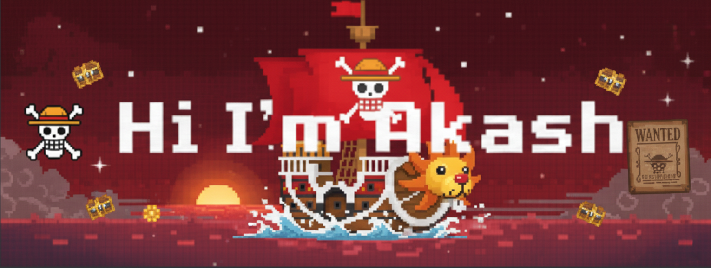

<table width="100%" style="border-collapse: collapse; border: none;">
  <tr style="border: none;">
    <td style="vertical-align: middle; border: none;">
      🍖 I am an Engineer who mainly focuses on Machine Learning and AI.
       
      🍖 I'm also capable of building full-stack applications too.
    </td>
    <td style="border: none; text-align: right; width: 240px;">
      
    </td>
  </tr>
</table>

<h3>Cool innit</h3>
<picture>
  <source media="(prefers-color-scheme: dark)" srcset="https://raw.githubusercontent.com/Akash-vadakkeveetil/Akash-vadakkeveetil/output/github-snake-dark.svg" />
  <source media="(prefers-color-scheme: light)" srcset="https://raw.githubusercontent.com/Akash-vadakkeveetil/Akash-vadakkeveetil/output/github-snake.svg" />
  
</picture>

